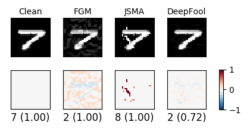
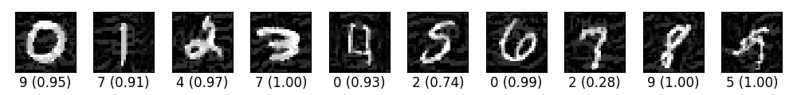
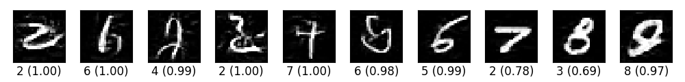
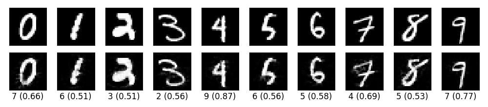
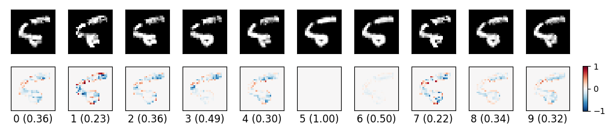
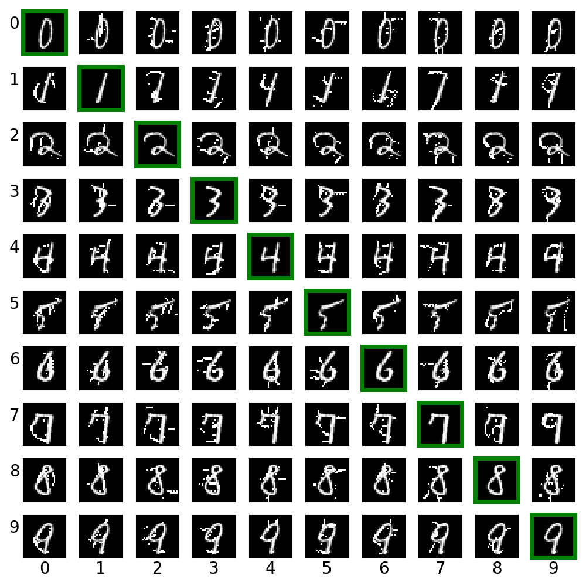
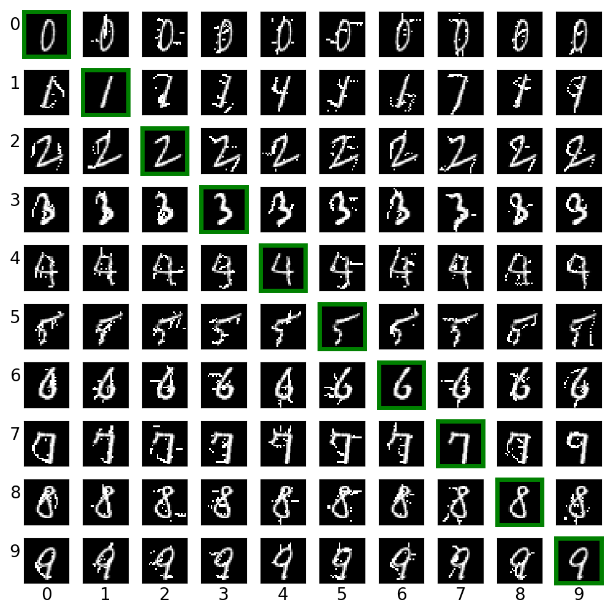
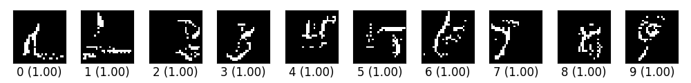

Craft Image Adversarial Samples with Tensorflow
===============================================

*THE CODE IS PROVIDED AS IT-IS, MAY NOT UPDATE IT ANYMORE.  HOPEFULLY IT IS STILL HELPFUL.*

[](https://zenodo.org/badge/latestdoi/77407674)

## Table of Contents

1. [API](#api)
2. [Dependencies](#dependencies)
3. [The `model`](#the-model)
4. [How to Use](#how-to-use)
5. [Results](#results)
6. [More Attacks](#more-attacks) *(outdated)*
7. [Related Work](#related-work)
8. [Citation](#citation)

This repo contains [adversarial image](https://arxiv.org/abs/1312.6199) crafting algorithms implemented in
**pure** Tensorflow.  The algorithms can be found in [attacks](attacks) folder.  The
implementation adheres to the principle **tensor-in, tensor-out**.  They all
return a Tensorflow operation which could be run through `sess.run(...)`.

## API

- Fast Gradient Method (FGM) [basic](https://arxiv.org/abs/1412.6572/)/[iterative](https://arxiv.org/abs/1607.02533)

  ```python
  fgm(model, x, eps=0.01, epochs=1, sign=True, clip_min=0.0, clip_max=1.0)
  ```

  If `sign=True`, use gradient sign as noise, otherwise use gradient values
  directly.  Empirically gradient sign works better.

- Fast Gradient Method with Target (FGMT)

  ```python
  fgmt(model, x, y=None, eps=0.01, epochs=1, sign=True, clip_min=0.0, clip_max=1.0):
  ```

  The only difference from FGM is that this is a targeted attack, i.e., a
  desired target can be provided.  If `y=None`, this implements the least-likely
  class method.

- [Jacobian-based Saliency Map Approach (JSMA)](https://arxiv.org/abs/1511.07528)

  ```python
  jsma(model, x, y, epochs=1, eps=1, clip_min=0, clip_max=1, score_fn=lambda t, o: t * tf.abs(o))
  ```

  `y` is the target label, could be an integer or a list.  when `epochs` is a
  floating number in the range `[0, 1]`, it denotes the maximum percentage
  distortion allowed and `epochs` is automatically deduced.  `k` denotes the
  number of pixels to change at a time, should only be 1 or 2.  `score_fn` is
  the function used to calculate the saliency score, default to be `dt/dx *
  (-do/dx)`, could also be `dt/dx - do/dx`.

- [DeepFool](https://arxiv.org/abs/1511.04599)

  ```python
  deepfool(model, x, noise=False, eta=0.01, epochs=3, clip_min=0.0, clip_max=1.0, min_prob=0.0)
  ```

  If `noise` is `True`, the return value is `noise`, otherwise only `xadv` is
  returned.  Note that in my implementation, the noise if calculated as
  `f/||w|| * w` instead of `f/||w|| * w/||w||`, where `||w||` is the L2 norm.
  It seems that `||w||` is so small such that noise will explode when adding it.
  In the [original author's implementation](https://github.com/LTS4/DeepFool/blob/master/Python/deepfool.py#L71), they add a small value 1e-4 for
  numeric stability, I guess we might have similar issue here.  Anyway, this
  factor does not change the direction of the noise, and in practice, the
  adversarial noise is still subtle and hard to notice.

- [CW](https://arxiv.org/abs/1608.04644)

  ```python
  cw(model, x, y=None, eps=1.0, ord_=2, T=2,
     optimizer=tf.train.AdamOptimizer(learning_rate=0.1), alpha=0.9,
     min_prob=0, clip=(0.0, 1.0)):
  ```

  Note that CW is a bit different from the above gradient-based methods in that
  it is an optimization-based attack.  Thus, it returns a tuple, `(train_op,
  xadv, noise)`.  After running `train_op` for desired epochs, run `xadv` to get
  the adversarial images.  Please note that it is OPTIMIZATION-BASED method,
  which means it is tricky.  You probably need to search for the best parameter
  configuration per image.  Otherwise, you will NOT get the amazingly good
  result reported in the paper.  It took me a couple of days to realize that the
  reason for my crappy adversarial images was not that my implementation was
  wrong, but rather, my learning rate was too small!!

## Dependencies

1. Python3, samples codes uses many of the Python3 features.
2. Numpy, only needed in sample codes.
3. Tensorflow, tested with Tensorflow 1.4.

## The `model`

Notice that we have `model` as the first parameter for every method.  The
`model` is a wrapper function to create the target model computation graph.  The
first parameter has to be the input `x`, other parameters may be added when
necessary, but they need to have default values.

```python
def model(x, logits=False):
  # x is the input to the network, usually a tensorflow placeholder
  ybar = ...                    # get the prediction
  logits_ = ...                 # get the logits before softmax
  if logits:
    return y, logits
  return y
```

## How to Use

Implementation of each attacking method is self-contained, and depends only on
TensorFlow.  Copy the attacking method file to the same folder as your source
code and import it.

The implementation should work on any framework that is **compatible** with
Tensorflow.  Examples are provided in [examples](examples) folder, each example
is *self-contained*.

## Results

- Comparison of all implemented algorithms.

  

- Fast gradient sign method adversarial on MNIST.

  

- Fast gradient value method adversarial on MNIST.

  

- DeepFool generate adversarial images.

  

- CW L2 generates targeted attack on a random select image, with binary search
  for the best `eps` value.

  

- JSMA generates cross label adversarial on MNIST.  Labels on the left are the
  true labels, labels on the bottom are predicted labels by the model.

  

- JSMA generates cross label adversarial on MNIST, with difference as saliency
  function, i.e., `dt/dx - do/dx`.

  

- JSMA generates adversarial images from blank images.

  

## More Attacks

The list is *outdated*.

- Moment iterative attack https://arxiv.org/abs/1710.06081
- Virtual adversarial https://arxiv.org/abs/1507.00677
- CarliniWagner (CW) https://arxiv.org/abs/1608.04644
- Elastic net https://arxiv.org/abs/1709.04114
- MadryEtAl https://arxiv.org/abs/1706.06083
- Fast feature https://arxiv.org/abs/1511.05122
- Houdini https://arxiv.org/abs/1707.05373

## Related Work

- [tensorflow/cleverhans](https://github.com/openai/cleverhans) Well maintained adversarial implementaion in TensorFlow.
- [LTS4/DeepFool](https://github.com/LTS4/DeepFool) Author's code for deepfool in PyTorch and Matlab.

## Citation

You are encouraged to cite this code if you use it for your work.  See the above
Zenodo DOI link.
