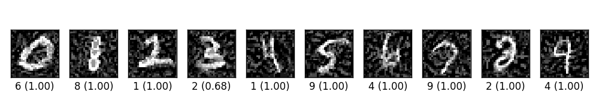
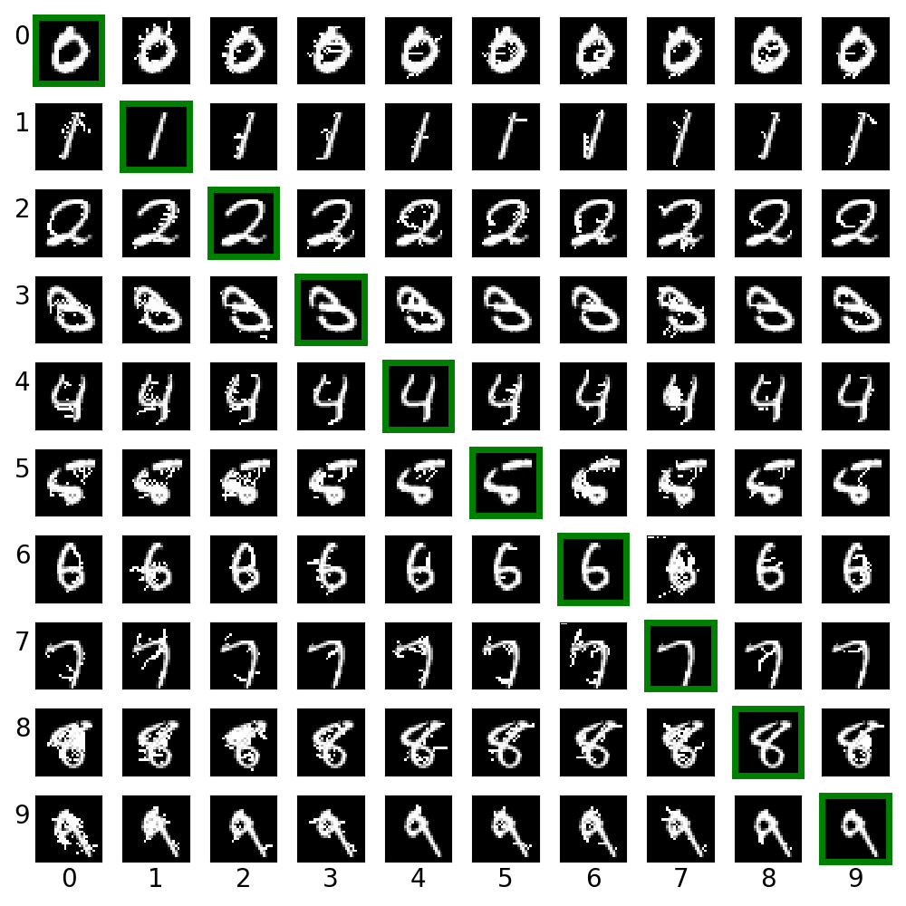
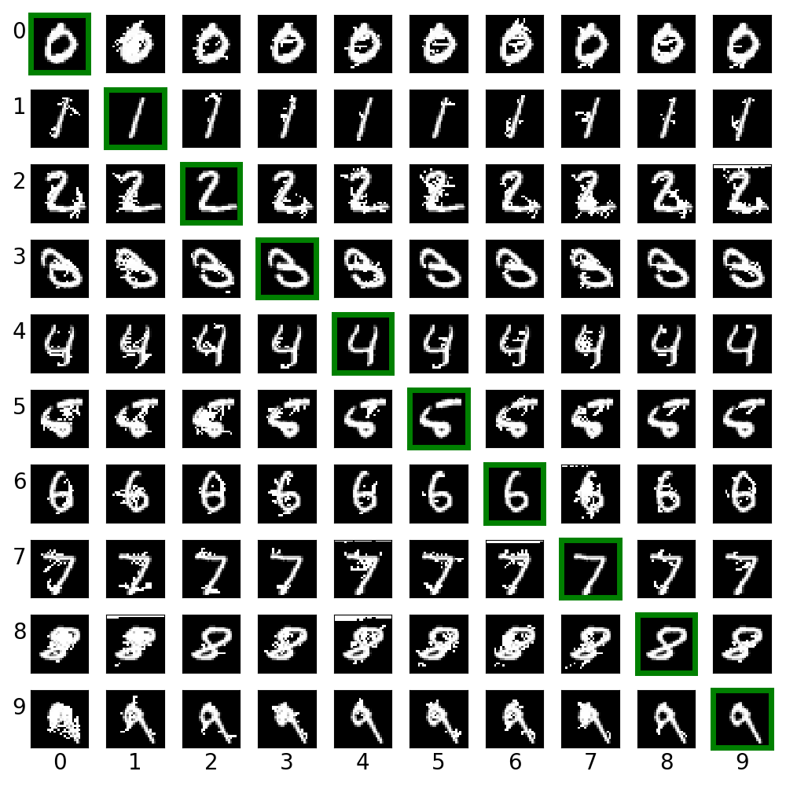
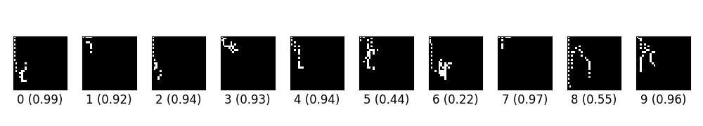
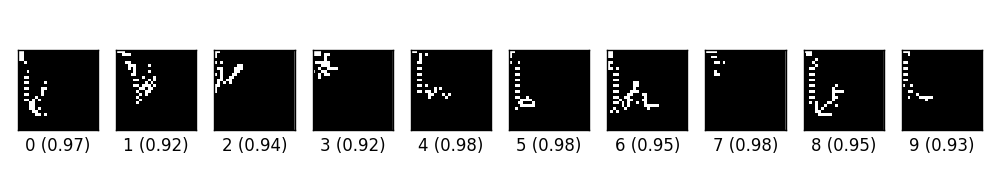
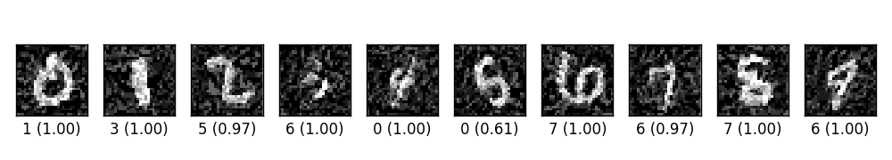
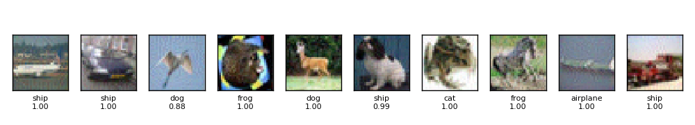

Craft Image Adversarial Samples with Tensorflow
===============================================

## Table of Contents

1. [API](#api)
2. [Dependencies](#dependencies)
3. [The `model`](#the-model)
4. [How to Use](#how-to-use)
5. [Results](#results)
6. [Future Work](#future-work)
7. [Related Work](#related-work)

Four [adversarial image](https://arxiv.org/abs/1312.6199) crafting algorithms are implemented with Tensorflow.
The four attacking algorithms can be found in [attacks](attacks) folder.  The
implementation adheres to the principle **tensor-in, tensor-out**.  They all
return a Tensorflow operation which could be run through `sess.run(...)`.

## API

- Fast Gradient Sign Method (FGSM) [basic](https://arxiv.org/abs/1412.6572/)/[iterative](https://arxiv.org/abs/1607.02533)

  ```python
  fgsm(model, x, eps=0.01, epochs=1, clip_min=0.0, clip_max=1.0)
  ```

- [Target class Gradient Sign Method (TGSM)](https://arxiv.org/abs/1607.02533)

  ```python
  tgsm(model, x, y=None, eps=0.01, epochs=1, clip_min=0.0, clip_max=1.0)
  ```

  1. When `y=None`, this implements the least-likely class method.
  2. If `y` is an integer or a list of integers, the source image is modified
     towards label `y`.
- [Jacobian-based Saliency Map Approach (JSMA)](https://arxiv.org/abs/1511.07528)

  ```python
  jsma(model, x, y, epochs=1.0, eps=1., clip_min=0.0, clip_max=1.0, pair=False, min_proba=0.0)
  ```

  `y` is the target label, could be an integer or a list.  when `epochs` is a
  floating number in the range `[0, 1]`, it denotes the maximum percentage
  distortion allowed and `epochs` is automatically deduced.  `min_proba` denotes
  the minimum confidence of target image.  If `pair=True`, then modifies two
  pixels at a time.

- Saliency map difference approach (SMDA)
  ```python
  smda(model, x, y, epochs=1.0, eps=1., clip_min=0.0, clip_max=1.0, min_proba=0.0)
  ```

  Interface is the same as `jsma`.  This algorithm differs from the JSMA in how
  the saliency score is calculated.  In JSMA, saliency score is calculated as
  `dt/dx * (-do/dx)`, while in SMDA, the saliency score is `dt/dx - do/dx`, thus
  the name "saliency map difference".

- [DeepFool](https://arxiv.org/abs/1511.04599)

  ```python
  deepfool(model, x, noise=False, eta=0.01, ord_=2, epochs=3, clip_min=0.0,
  clip_max=1.0, min_prob=0.0)
  ```

  If `noise` is `True`, the return value is `xadv, noise`, otherwise only `xadv`
  is returned.  `ord_` controls which norm to use, could be any real value in
  `[1, inf)`.

## Dependencies

1. Python3, samples codes uses many of the Python3 features.
2. Numpy, only needed in sample codes.
3. Tensorflow, tested with Tensorflow 1.1 and 1.3.  Since there is no change in
   the API (only minor version number change), it should work with other
   versions as well.

## The `model`

Notice that we have `model` as the first parameter for every method.  The
`model` is a wrapper function.  It should have the following signature

```python
def model(x, logits=False):
  # x is the input to the network, usually a tensorflow placeholder
  ybar = ...                    # get the prediction
  logits_ = ...                 # get the logits before softmax
  if logits:
    return y, logits
  return y
```

We need the logits because some algorithms (FGSM and TGSM) rely on the logits to
compute the loss.

## How to Use

Implementation of each attacking method is self-contained, and depends only on
`tensorflow`.  Copy the attacking method file to the same folder as your source
code and import it.

The implementation should work on any framework that is **compatible** with
Tensorflow.  I provide example code for Tensorflow and Keras in the folder
[tf_example](./tf_example) and [keras_example](./keras_example), respectively.  Each code example is also
self-contained.

And example code with the same file name implements the same function.  For
example, [tf_example/ex_00.py](tf_example/ex_00.py) and [keras_example/ex_00.py](keras_example/ex_00.py) implement
exactly the same function, the only difference is that the former uses pure
Tensorflow while the latter is built upon Keras.

## Results

- ex_00.py trains a simple CNN on MNIST.  Then craft adversarial samples from
  test data vis FGSM.  The original label for the following digits are 0 through
  9 originally, and the predicted label with probability are shown below each
  digit.

  

- ex_01.py creates cross label adversarial images via saliency map approach
  (JSMA).  For each row, the digit in green box is the clean image.  Other
  images on the same row are created from it.

  

- ex_02.py creates cross label adversarial images via target class gradient sign
  method (TGSM).

  

- ex_03.py creates digits from blank images via saliency different algorithm
  (SMDA).

  

- ex_04.py creates digits from blank images via paired saliency map algorithm,
  i.e., modify two pixels at one time (refer to the original paper for rational
  http://arxiv.org/abs/1511.07528).

  

  ~~These images look weird.  And I have no idea why I could not reproduce the
  result in the original paper.  My guess is that~~

  ~~1. either my model is too simple to catch the features of the dataset, or~~
  ~~2. there is a flaw in my implementation.~~

  ~~However various experiments seem to suggest that my implementation work
  properly.  I have to try more examples to figure out what is going wrong
  here.~~

  As suggested by [Nicolas](https://papernot.fr/), I run JSMA for fixed epochs, and I could
  reproduce the images in his original paper.  So it seems my JSMA
  implementation is correct.

- ex_05.py trains a simple CNN on MNIST and then crafts adversarial samples via
  LLCM.  The original label for the following digits are 0 through 9 originally,
  and the predicted label with probability are shown below each digit.

  

- ex_06.py trains a CNN on CIFAR10 and then crafts adversarial image via FGSM.

  

## Future Work

- [ ] Update code with newer API from TensorFlow v1.3
- [ ] Add ImageNet examples
- [ ] Add attack method from https://arxiv.org/abs/1507.00677
- [ ] Add attack method from https://arxiv.org/abs/1608.04644
- [ ] Add houdini attack from https://arxiv.org/abs/1707.05373
- [ ] Add benchmark for various defense methods.  There are so many of them,
  probably need a good survey, e.g. https://arxiv.org/abs/1705.07263.

## Related Work

- [openai/cleverhans](https://github.com/openai/cleverhans)
- A list of related papers could be found [RELATED.md](./RELATED.md).
